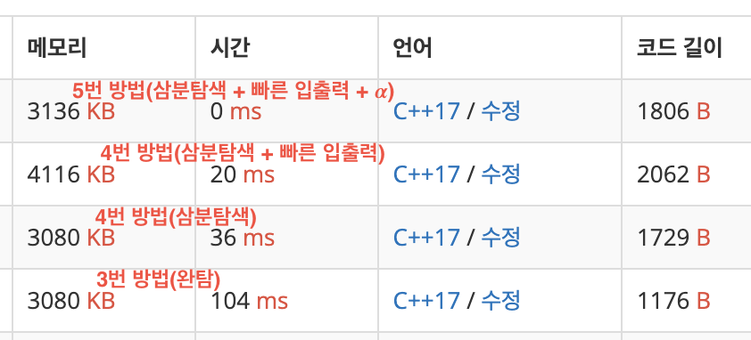

## [18111번 (마인크래프트)](https://www.acmicpc.net/problem/18111)

### 18111번 (마인크래프트) 문제 요약

집터를 평탄화 하는데 걸리는 시간의 최소값과 그때의 높이를 출력하라.<br/>
[1, 500] 구간의 자연수 N, M, 인벤토리에 가지고 있는 블럭의 수 B 가 첫째줄에 주어진다.<br/>
집터의 높이가 N * M 크기의 배열로 주어진다. 각각의 높이는 구간[0, 256]의 정수다.<br/>
집터를 평탄화 하기 위해 블럭을 인벤토리에 넣거나 인벤토리의 블럭을 쌓을 수 있다.<br/>
블럭을 인벤토리에 넣는데 2초, 인벤토리에서 꺼내어 쌓는데 1초가 걸린다.<br/>
걸리는 시간이 같다면 더 높은 높이를 출력하라.

### 18111번 (마인크래프트) 문제 풀이

1. 1칸짜리 집터를 특정 높이로 만드는데 걸리는 시간은 O(1) 시간에 구할수 있다.

2. N \* M 크기의 전체 집터를 특정 높이로 만드는데 걸리는 시간은 O(N\*M) 시간에 구할수 있다.

3. 구간 [0, 256]의 모든 높이에 대해 평탄화 시간을 구하면 257개의 시간값이 나올 것이다. 그중 최소값을 구하면 된다. 최악의 경우 N = 500, M = 500 이므로 **257 \* 500 \* 500**번 이상 반복해야 하고, 문제 조건(1초)을 통과 가능한 수준이다. **(= 완전탐색 방법)**

4. 높이 값이 정답에 가까워 질수록 평탄화 시간이 줄어드는 것을 알수 있다. 따라서 구간을 1/3씩 줄여가는 삼분탐색 알고리즘을 쓴다면, 최악의 경우 **12 \* 500 \* 500**번 이상 반복해야 한다. **(= 삼분탐색 방법)**

5. 특정 높이로 평탄화 하는데 걸리는 시간을 O(N*M)이 아닌, 257번 반복으로 구할 수 있다. 이 방법을 삼분탐색 방법과 같이 사용하면, 최악의 경우 **12 \* 257**번 이상 반복해서 구할 수 있다. **(= 삼분탐색 + 𝜶)**

   1. 크기가 257인 배열 height[257]을 만든다.
   
   2. 입력받는 N * M 개의 높이값 input[n][m] 마다 height[input[n][m]]를 1씩 더해준다.
   
   3. 구간 [0, 256]의 모든 i에 대해 time += h < i ? (i-h)\*2\*height[i] : (h-i)\*height[i]; 을 계산해주면 높이 h로 평탄화 하는데 걸리는 시간을 계산할수 있다.

위에 적힌 방법중 3번 까지만 적용해도 이 문제를 푸는데 지장이 없다.

아래의 코드는 빠른 입출력 방법과 위의 5번 방법을 적용했다.

```cpp
using vi = vector<int>;

int getTime(vi &height, int &b, int h) {
    int time = 0;
    for (int i = 0; i < height.size(); i++) {
        time += h < i ? (i-h)*2*height[i] : (h-i)*height[i];
        b += (i-h)*height[i];
    }
    return time;
}

int main() {
    buffer[fread(buffer, 1, sz, stdin)] = 0;
    int N = getNum(); //빠른 입출력
    int M = getNum();
    int B = getNum();
    
    vi height(257, 0);
    for (int i = 0; i < N; i++)
        for (int j = 0; j < M; j++)
            height[getNum()]++; //5번 방법
    
    int lo = 0, hi = 256;
    while (lo + 2 < hi) { //삼분탐색
        int h1 = (lo * 2 + hi) / 3;
        int h2 = (lo + hi * 2) / 3;
        int b1 = B;
        int b2 = B;
        
        int time1 = getTime(height, b1, h1);
        int time2 = getTime(height, b2, h2);
        
        if (b2 < 0) { //블럭이 부족해서 쌓지 못하는 경우
            if (b1 < 0)
                hi = h1 - 1;
            else
                hi = h2 - 1;
            continue;
        }
        
        if (time1 >= time2) {
            lo = h1;
        } else {
            hi = h2;
        }
    }
    
    int answerTime = 501 * 501 * 257, answerHeight = 0;
    for (int h = lo; h <= hi; h++) { //답 구하기
        int b = B;
        int time = getTime(height, b, h);
        
        if (b < 0) break; //블럭이 부족해서 쌓지 못하는 경우
        
        if (answerTime >= time) {
            answerTime = time;
            answerHeight = h;
        }
    }
    
    printf("%d %d\n", answerTime, answerHeight);
}
```


*방법별 속도 비교*