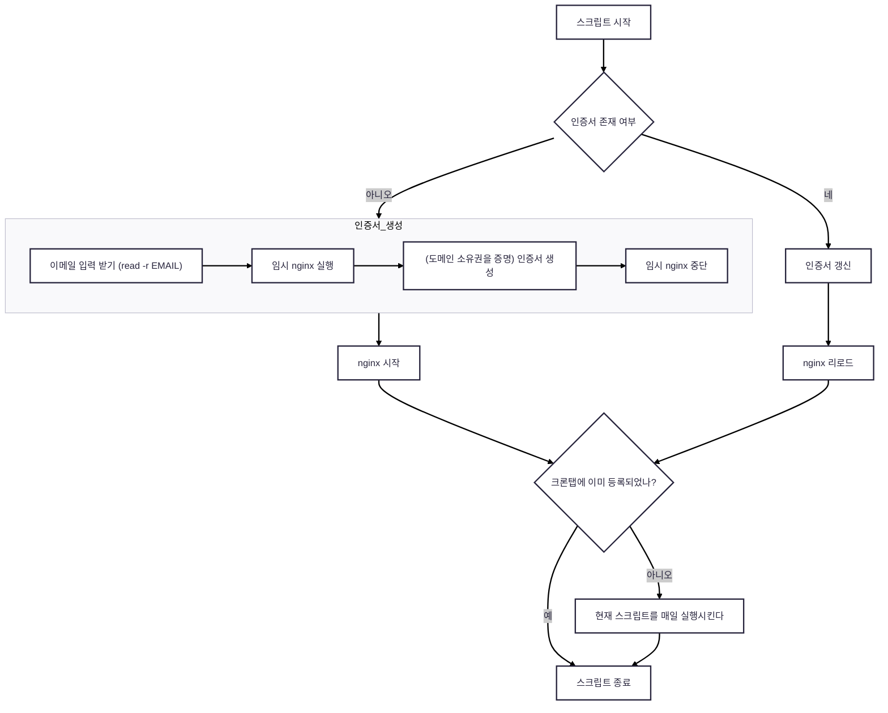

# 서론
팀원들의 프론트 개발을 돕기 위해, 백엔드 API 서버를 구축하여 원격으로 요청할수 있게 했다.

이때 내부적인 사정이 있어서, 추후 더 좋은 성능의 EC2 인스턴스로 마이그레이션하기로 예정되어 있었고,
나중에 편하게 마이그레이션하기 위해, 인증서 발급 과정을 쉘 스크립트로 자동화하게 되었다.

쉘 스크립트 파일에 작성한 로직은 아래와 같고, 실제 [코드는 여기](https://github.com/CEC-project/CEC-Back/blob/main/docker/nginx-ssl/start-certbot.sh)서 볼수 있다.

`도메인 소유권 증명` 에 대해 전혀 몰랐기 때문에,  저 코드를 짜는게 예상만큼 쉽지 않았다.
`도메인 소유권 증명` 이 뭔지, `ACME 프로토콜` 이 뭔지에 대해서 이어서 설명하겠다.

---

# ACME 프로토콜이란?
acme 프로토콜은 certbot, acme.sh 등의 프로그램이 CA 와 소통하여 인증서를 발급받는 http 상에서 동작하는 프로토콜이다. [RFC 8555](https://datatracker.ietf.org/doc/html/rfc8555) 를 보면 아주 상세히 설명되어 있다.
이 acme 프로토콜의 가장 핵심적인 부분을 꼽으라면 도메인 소유권을 증명하는 부분이라고 생각한다.

acme 프로토콜은 도메인 소유권을 증명하는 두가지 방법을 지원한다. (http-01, dns-01)
(아래 내용에서 클라이언트는 acme 프로토콜의 issuer인, 인증서를 발급받는 쪽을 의미한다)

http-01 방법을 간단히 설명하면 아래와 같다.
1. CA 에서 토큰을 클라이언트에 준다.
2. 클라이언트가 example.com 도메인의 약속된 url 에 웹 서버를 통해 토큰을 노출시킨다.
	1. 이 과정은 nginx 설정을 잘 해준다면 nginx 플러그인 없이도 자동으로 가능하다.
3. CA 는 자기가 클라이언트에 준 토큰을 example.com 의 약속된 url 에서 확인한다.
4. CA 는 클라이언트가 example.com 도메인을 소유하고 있다는 것을 확인하였다!

dns-01 방법을 간단히 설명하면 아래와 같다.
1. CA 에서 토큰을 클라이언트에 준다.
2. 클라이언트 측은 example.com 도메인의 DNS에 TXT 레코드를 추가하고 토큰을 넣는다.
	1. 이 과정을 자동으로 진행하려면 [certbot 의 플러그인](https://help.zerossl.com/hc/en-us/articles/4409936415001-Overview-of-the-changes-to-Wildcard-and-Multi-Domain-certificates)을 쓰거나 [acme.sh](https://help.zerossl.com/hc/en-us/articles/4409936415001-Overview-of-the-changes-to-Wildcard-and-Multi-Domain-certificates) 를 쓰자.
3. CA 는 자기가 클라이언트에 준 토큰을 example.com 의 TXT 레코드를 확인한다.
	1. 윈도우 cmd 기준 nslookup -type=txt example.com 명령어를 통해 조회할수 있다고 한다.
4. CA 는 클라이언트가 example.com 도메인을 소유하고 있다는 것을 확인하였다!

내가 위에서 짠 쉘 스크립트는 http-01 방법 (HTTP Challenge) 를 사용한다.
http-01 방법을 사용할때 주의할 점은, http-01 방법으로는 certbot 기준으로 와일드카드 인증서를 발급받을 수 없다. 와일드카드 인증서란, 특정 도메인의 하위 도메인을 전부 포함하는 인증서를 말한다. RFC 8555 에는 http-01 로 와일드카드 인증서를 발급하지 못한다고 쓰여있진 않지만, 와일드카드 인증서는 dns-01 로 발급해 주는것이 업계 표준으로 보인다.
([RFC 8555 9.7.8](https://datatracker.ietf.org/doc/html/rfc8555/#section-9.7.8) : validation method 가 http-01 이든 dns-01 이든 identifier type 은 dns 이다.)
([RFC 8555 7.1.3.](https://datatracker.ietf.org/doc/html/rfc8555/#section-7.1.3) : identifier type 가 dns 면 와일드카드가 가능하다고 나와있다.)
([하지만 ZeroSSL 은 http 방식으로 와일드카드를 지원하지 않는다고 한다.](https://help.zerossl.com/hc/en-us/articles/4409936415001-Overview-of-the-changes-to-Wildcard-and-Multi-Domain-certificates))
([Let's Encrypt 도 http 방식으로 와일드카드를 지원하지 않는다.](https://help.zerossl.com/hc/en-us/articles/4409936415001-Overview-of-the-changes-to-Wildcard-and-Multi-Domain-certificates))

---

아무튼, 자동화 쉘 스크립트를 짜는 과정에서 위와 같은 내용을 조사하였다.
사실 1회-2회 정도만 사용할 스크립트이기 때문에, 서론에서 말한 쉘 스크립트를 꼭 짜야할 필요는 없었다.
스크립트에 투자한 시간과 노력 대비 가치는 떨어졌지만, 애초에 공부와 실습 목적이 강했던 프로젝트 였고, 이 과정에서 알게된 지식들이 언젠가는 도움이 될거라고 생각한다.

아마 다음 개발 일지 글은 rate limit 기능 구현과정을 쓰게 될거 같은데, 가독성을 중요시 생각하며 작성하겠다.