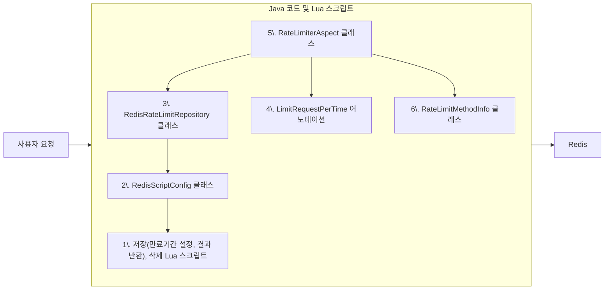

이 프로젝트가 마무리 되고, 내가 구현한 기능중에 개선점이 없는지 다시한번 살펴보았다.
그런데 로그인 기능에 `실패 횟수 제한 기능`이 없는 것이었다. 아무리 기획한 내용에 해당 기능이 명시되지 않았다고는 해도, 아주 기본적인 기능조차 없는데도 내 기술력을 어필하기 위한 개선점을 찾고 있었던 것이 부끄러웠다.

이후 `로그인 실패 횟수 제한 기능`을 찾아보며, Rate Limit(= 클라이언트가 서버에 요청할 수 있는 횟수를 제한하는 기술)에 대해 알게 되었다. Rate Limit 와 `로그인 실패 횟수 제한 기능` 는 비슷한 점이 많은 기능이므로 함께 구현하게 되었다.

주요 요구사항은 아래와 같다.
1. 로그인 실패 횟수 제한
	1. 로그인 성공시 로그인 실패한 횟수가 초기화 되어야 한다.
	2. 10분당 5회까지만 실패할 수 있게 해도 보안이 크게 향상될 것이다.
	3. 로그인 시도한 id 를 기준으로 동일한 클라이언트인지 판별해야 한다.
		1. 본 프로젝트는 학과에서 사용할 것이므로, ip 로 판별하면 학생 모두가 접속이 안될수 있다.
2. 일반적인 API
	1. 동일 요청에 초당 5회 정도의 제한을 두면, 사용에도 불편이 없을 것이고, 혹시 모를 공격에 의한 비용 폭탄도 방지할 수 있을 것이다.
	2. 이미 로그인한 id 를 기준으로 동일한 클라이언트인지 판별해야 한다.

### Rate Limit 란?
클라이언트가 서버에 요청할 수 있는 횟수를 제한하는 기술.
이를 구현하기 위한 다양한 방식이 있다.
- Token Bucket
	- 클라이언트가 가진 토큰을 일정 시간마다 충전시켜주고, 요청시마다 토큰을 하나씩 소모하는 방식.
	- 실 서비스에서 많이 사용. 순간 버스트를 버킷의 크기로 제한할 수 있음.
- Leaky Bucket
	- 서버가 동일한 시간동안 정해진 양의 토큰만 처리할 수 있음.
	- 네트워크 장비 (스위치/라우터) 에서 많이 사용. QoS(혼잡제어)를 위해 주로 사용. 버스트 처리 힘듬.
- Fixed Window Counter
	- 정해진 시간대 별로 요청한 횟수를 카운팅한다.
	- 예) 하루에 10번 요청이 가능한 제한을 Fixed Window Counter 로 구현하면, 오늘 23시 59분에 10번, 내일 00시 00분에 10번 요청하여 단시간에 20번 요청할수 있다.
- Sliding Window
	- Sliding Window Counter
		- Fixed Window 처럼 시간대 별로 요청한 횟수를 카운팅 하되, 적절히 보간하여 단시간에 요청이 몰리는 것을 막는다.
	- Sliding Window Log
		- 매 요청마다 로그를 남겨서, 이전 로그들을 바탕으로 요청을 받을지 여부를 정한다.
		- 가장 정확한 방법이다. 구현 난이도나 서버 부하가 크다.

### 위 방식들중 무엇을 사용할 것인가?
내가 고려한 조건은 아래와 같다.
1. 단시간에 원래 제한을 넘어서는 요청을 하면 안된다.
2. 횟수 제한 내에서는 연속으로 요청할 수 있어야 한다.
3. 최근 요청한 시각을 표시하는 기능을 나중에 구현할 수도 있는데, 그때 로그를 조회하여 구현하고 싶다.

`Fixed Window Counter` 는 1번 조건을 만족하지 못한다.
`Leaky Bucket `은 2번 조건을 만족하지 못한다.
`Token Bucket` 과 `Sliding Window Counter` 는 로그를 저장하지 않으므로 3번 조건을 만족하지 못한다.
따라서 `Sliding Window Log` 방식을 선택하게 되었다.

### Sliding Window Log 를 어떻게 구현하는게 좋을까?
Sliding Window Log 를 구현하기 위해서는 로그를 저장할 DB가 있어야 한다.
RDB 는 로그를 저장하기에는 비용이 높은 자원이므로, In-memory DB를 사용하는게 맞다고 판단하였다.
그 중에서도 현재 프로젝트에서 사용중이며, 기능도 다양한 Redis 를 사용하는게 맞다고 판단하였다.

Redis 가 지원하는 다양한 자료구조 중에서, 나에게 적합한 것을 고르기 위해 고려해야 했던 것들은 아래와 같다.
1. 로그 삽입, 특정 시간동안의 로그에 대한 조회, 특정 시간동안의 로그에 대한 삭제가 빨라야 한다.
2. 시간이 오래 지난 로그들을 만료시키는 기능이 있어야 한다.

Redis 는 [Sorted sets](https://redis.io/docs/latest/develop/data-types/sorted-sets/) 라는 자료구조를 지원하고 있는데, 위 두가지 조건에 딱 맞는다.

Sorted sets 자료구조는 [ZADD](https://redis.io/docs/latest/commands/zadd/), [ZRANGE](https://redis.io/docs/latest/commands/zrange/), [ZREMRANGEBYSCORE](https://redis.io/docs/latest/commands/zremrangebyscore/) 명령어들을 지원하는데, 각각 삽입, 구간에 대한 조회, 구간에 대한 삭제 명령어이다. 트리가 N개의 노드를 가질때, 각각 O(log(N)), O(log(N) + M), O(log(N) + M) 시간 복잡도를 가진다. 따라서 1번 조건을 만족한다.

또한 키 하나와 트리 하나가 대응되며, 키에 만료 시간을 걸 수 있기 때문에, 로그를 트리에 저장하고 키에 만료시간을 걸면 로그들이 필요없어지는 순간에 한꺼번에 만료시킬 수 있다. 물론 트리에 새로운 로그를 추가하고 만료시간을 갱신할수도 있다. 키에 만료 시간을 걸수 있기에 2번 조건을 만족한다.

> 이 Sorted sets 자료구조를 자바 콜렉션으로 표현하자면, HashMap\<String, TreeMap\<Double, String\>\> 와 비슷하다. 각각의 키마다 대응되는 트리가 존재하고, 트리의 각 데이터는 (우선순위 점수, 값) 쌍으로 이루어져 있다.

### 이제 Sliding WIndow Log 방식으로 Rate Limit 를 구현해보자
아래는 Sliding Window Log 를 구현하기 위해 어떤 코드를 작성했는지 그림으로 나타낸 것이다.
`A`가 `B`를 화살표로 가리키면, `A`가 `B`를 사용/호출/의존한다는 의미이다.
1번부터 6번 순서대로 내가 어떤 식으로 코드를 작성했는지 소개하겠다.


### 1. 저장(만료기간 설정, 결과 반환), 삭제 Lua 스크립트
우선 Redis 에 로그를 `저장(만료기간 설정, 결과 반환)`하고 `삭제`하는 Lua 언어 스크립트를 짜야한다.
`Spring Data Redis` 에서 제공하는 [RedisTemplate](https://docs.spring.io/spring-data/redis/reference/api/java/org/springframework/data/redis/core/RedisTemplate.html) 을 사용하면, 자바만 가지고 레디스의 모든 명령어를 쓸수 있다. 하지만 그럼에도 Lua 스크립트를 쓰는데에는, 성능/원자성 등의 이유가 있다. ([공식문서](https://redis.io/docs/latest/develop/programmability/eval-intro/))

로그를 `저장(만료기간 설정, 결과 반환)`하는 Lua 코드([깃허브 링크](https://github.com/CEC-project/CEC-Back/blob/736fb032acf970a15c7f20841ab84984ffba4023/src/main/resources/META-INF/scripts/rate_limit/add.lua)) 는 아래와 같다.
깃허브 링크를 클릭하면 더 상세한 설명을 볼수 있다.
```lua
-- 인자를 받음
local key = KEYS[1]
local windowMillis = tonumber(ARGV[1])
local threshold = tonumber(ARGV[2])

-- 현재 시간을 밀리초 단위로 읽음
local t = redis.call('TIME')
local nowMillis = tonumber(t[1]) * 1000 + math.floor(tonumber(t[2]) / 1000)

-- window 범위를 벗어난 요청 기록들을 삭제
redis.call("ZREMRANGEBYSCORE", key, 0, nowMillis - windowMillis)

-- 요청 기록의 개수를 조회
local count = redis.call("ZCARD", key)
if count >= threshold then
    -- count 가 threshold 를 넘겼다면, 음수로 window 범위에서 가장 오래된 요청 시간을 반환
    local firstRequestTime = redis.call("ZRANGE", key, 0, 0)[1]
    return -tonumber(firstRequestTime)
end

-- 새 요청 기록 추가
redis.call("ZADD", key, nowMillis, nowMillis)

-- 메모리 낭비를 막기 위해, Key 에 만료시간 걸기
redis.call("EXPIRE", key, (windowMillis / 1000) + 1)

-- 요청 기록의 개수 반환
return count + 1
```

### 2. RedisScriptConfig 클래스
1.에서 Lua 스크립트 코드를 작성했으니, 이제 코드를 자바 코드로 쓸 수 있게 불러와야 한다.
또한 불러온 스크립트를 호출할 때마다 사용하는 RedisTemplate.execute() 메소드에 두가지 문제점이 있었다.
1. 메소드의 인자가 가변인자여서 스크립트가 어떤 인자를 가지는지 알수 없었다.
2. 스크립트가 숫자를 인자로 받더라도 문자열로 변환해서 넘겨줘야 하는 불편함이 있다.

따라서 불러온 스크립트마다 메소드를 만들어서 불편함을 줄이려고 했다.
([깃허브 링크](https://github.com/CEC-project/CEC-Back/blob/736fb032acf970a15c7f20841ab84984ffba4023/src/main/java/com/backend/server/config/RedisScriptConfig.java))
```java
@Component
@RequiredArgsConstructor
public class RedisScriptConfig {

    private final RedisTemplate<String, String> redisTemplate;

    private final RedisScript<Long> rateLimit_add = RedisScript.of(
            new ClassPathResource("META-INF/scripts/rate_limit/add.lua"),
            Long.class);

    private final RedisScript<Long> rateLimit_delete = RedisScript.of(
            new ClassPathResource("META-INF/scripts/rate_limit/delete.lua"),
            Long.class);

    public Long rateLimitAdd(String key, long windowMillis, int threshold) {
        return redisTemplate.execute(
                rateLimit_add,
                Collections.singletonList(key),
                String.valueOf(windowMillis),
                String.valueOf(threshold));
    }

    public Long rateLimitDelete(String key) {
        return redisTemplate.execute(
                rateLimit_delete,
                Collections.singletonList(key));
    }
}
```

### 3. RedisRateLimitRepository 클래스
로그를 `저장(만료기간 설정, 결과 반환)` 하는 Lua 스크립트를 보면, 반환하는 시나리오가 두가지로 나뉜다.
1. 요청 횟수 제한을 초과하면 `window 범위내에서 가장 오래된 요청 시간` 을 음수로 바꾸어 반환한다.
2. 요청 횟수 제한을 넘지 않으면 `window 범위내에서 현재까지 요청받은 개수`를 반환한다.

위 시나리오를 보면 커다란 문제가 있는데, 어떤 시나리오에서든 공통적으로 숫자 값을 반환하며, 그 숫자가 음수인지 양수인지에 따라 `특별한 의미`를 가진다는 것이다.
미래의 내가 이해하기 쉬운 코드 또는 유지보수가 쉬운 코드 를 작성하려면, `처음 본 사람의 입장`에서도 그 의도가 명확해야 한다고 생각한다.
이 스크립트/메소드를 `처음 본 사람의 입장`에서 이 코드들의 의도를 생각해 봤을때, 스크립트 파일명이나 메소드 명에 적혀있는 `Add / Delete`라는 단어를 통해, `Rate Limit 를 구현하기 위한 기록을 추가 / 삭제` 하는 것을 가장 큰 의도라고 여길 것이다.
반환값이 음수일때만 `특별한 의미`가 있다는 것은 인지 부하도 크고, `처음 본 사람의 입장`에서는 그 `특별한 의미`를 모를 수밖에 없을 것이다. 그렇다고 해서, 이 의미있는 Long값 정보를 버리고 Boolean값 참/거짓만 반환하는 것도 최선이 아니라고 판단했다.
따라서, 요청 횟수 제한을 초과하였을 때는 [커스텀 예외](https://github.com/CEC-project/CEC-Back/blob/736fb032acf970a15c7f20841ab84984ffba4023/src/main/java/com/backend/server/api/common/exceptionHandler/exception/TooManyRequestException.java)를 throw 하고 예외 클래스내에 정보를 담도록 하였고, 요청 횟수 제한을 넘지 않으면 그대로 정보를 반환하도록 코드를 짰다.

또한, 이러한 코드가 어디에 위치해야 할지 고민했는데, 외부 저장소와 밀접하게 연관된 RedisScriptConfig 클래스를 사용한다는 점 때문에, Repository 레이어에 위치시켰다. 또한 이 클래스가 RateLimitRepository 인터페이스를 구현하게 하고, 사용할때도 RateLimitRepository 인터페이스로 사용하여, 레디스가 아닌 다른 기술을 써도 변경이 이 이상 전파되지 않게 했다.

RedisScriptConfig 클래스와 RedisRateLimitRepository 클래스를 합칠지도 고민했는데, Lua 스크립트를 불러오는 것만 전담하는 RedisScriptConfig 클래스가 필요하다고 생각되어 분리해 두었다.
([깃허브 링크](https://github.com/CEC-project/CEC-Back/blob/736fb032acf970a15c7f20841ab84984ffba4023/src/main/java/com/backend/server/model/repository/rateLimit/RedisRateLimitRepository.java))
```java
@Component
@RequiredArgsConstructor
public class RedisRateLimitRepository implements RateLimitRepository {

    private final RedisScriptConfig scripts;

    @Override
    public Long add(String key, LimitRequestPerTime limit) throws TooManyRequestException {
        final long windowMillis = limit.timeUnit().toMillis(limit.time());
        final int threshold = limit.count();

        Long result = scripts.rateLimitAdd(key, windowMillis, threshold);

        // 요청 횟수 제한을 초과했을때
        if (result < 0) {
            LocalDateTime now = LocalDateTime.now();
            LocalDateTime retryAvailableAt = Instant
                    .ofEpochMilli(-result + windowMillis)
                    .atZone(ZoneId.systemDefault())
                    .toLocalDateTime();
            Duration retryAfter = Duration.between(now, retryAvailableAt);
            throw new TooManyRequestException(limit, retryAfter);
        }

        return result;
    }

    @Override
    public Long delete(String key) {
        return scripts.rateLimitDelete(key);
    }
}
```

### 4. LimitRequestPerTime 어노테이션
우리는 스프링에서 지원하는 AOP 라는 기능을 사용할 것이다. 이를 사용하면, `특정 어노테이션이 붙은 메소드`가 호출되기 전이나, 반환된 후에 원하는 로직을 실행할 수 있는데, 우리가 만드는 `클라이언트의 요청을 조건에 따라 제한하는 기능`을 구현하기에 아주 적합하다.

아래는 주요 요구사항이다.
1. 로그인 실패 횟수 제한
	1. 로그인 성공시 로그인 실패한 횟수가 초기화 되어야 한다.
	2. 10분당 5회까지만 실패할 수 있게 해도 보안이 크게 향상될 것이다.
	3. 로그인 시도한 id 를 기준으로 동일한 클라이언트인지 판별해야 한다.
		1. 본 프로젝트는 학과에서 사용할 것이므로, ip 로 판별하면 학생 모두가 접속이 안될수 있다.
2. 일반적인 API
	1. 동일 요청에 초당 5회 정도의 제한을 두면, 사용에도 불편이 없을 것이고, 혹시 모를 공격에 의한 비용 폭탄도 방지할 수 있을 것이다.
	2. 이미 로그인한 id 를 기준으로 동일한 클라이언트인지 판별해야 한다.

그에 따라 어노테이션에 필요한 인자는 다음과 같다.
1. 몇초에 몇회 제한을 걸 것인지
	- `time` : 시간, `timeUnit` : 시간단위, `count` : 횟수
2. 무엇을 기준으로 클라이언트를 식별할 것인지
	- `identifier` : 기본값은 로그인한 계정 id(= 학번) / SpEL 을 이용한 표현식(= 로그인 시도한 id)
3. 이 어노테이션이 붙은 메소드가 정상 반환되면, 초기화 시킬 것인지(= 로그인 성공시 실패 횟수 초기화)
	- `resetOnSuccess` : 정상 반환시 초기화 여부

([깃허브 링크](https://github.com/CEC-project/CEC-Back/blob/736fb032acf970a15c7f20841ab84984ffba4023/src/main/java/com/backend/server/support/rateLimit/LimitRequestPerTime.java))
```java
/**
 * rate limit (요청 횟수 제한)을 적용시키는 어노테이션 입니다.<br>
 * 사용자 식별자와 패키지경로+클래스명+메소드명 을 기준으로 동일한 요청인지 판단합니다.<br>
 * 어노테이션이 중복으로 적용된 경우 "메소드, 클래스, 인터페이스, 부모클래스" 중에서 가장 앞에 있는 것이 적용됩니다.
 */
@Target({ElementType.TYPE, ElementType.METHOD})
@Retention(RetentionPolicy.RUNTIME)
public @interface LimitRequestPerTime {

    /**
     * SpEL 표현식으로 매개변수에서 사용자 식별자(String 타입)를 가져와 사용할수 있습니다.<br>
     * (기본값 : 로그인한 계정의 사용자 학번)<br>
     * 예를 들어, 이 필드에 "Sting.valueOf(#a.getId())" 을 대입한 경우 아래와 같은 뜻이 됩니다.<br>
     * 이 어노테이션이 붙은 메소드에 a 라는 매개변수가 있다. a.getId() 메소드를 호출한 결과를 문자열로 변환시켜서 사용자 식별자로 사용하겠다.
     */
    String identifier() default "";

    /**
     * 요청 제한 시간<br>
     * (기본값 : 1)
     */
    int time() default 1;

    /**
     * 요청 제한 시간 단위<br>
     * (기본값 : TimeUnit.MINUTES)
     */
    TimeUnit timeUnit() default TimeUnit.MINUTES;

    /**
     * 요청 제한 횟수<br>
     * (기본값 : 5)
     */
    int count() default 5;

    /**
     * 이 어노테이션이 붙은 메소드가 예외 throw 없이 정상적으로 반환되었을때, 기존 요청 기록을 삭제하는 기능<br>
     * (기본값 : false)<br>
     * 예를 들어, 로그인 성공시 로그인 실패 횟수를 초기화 시키는 것을 구현할수 있습니다.
     */
    boolean resetOnSuccess() default false;
}
```

### 5. RateLimiterAspect 클래스
이제 여태까지 작성한 코드와 스프링의 AOP 기능을 사용하여, 클라이언트의 요청이 제한되어야 하는 경우, 메소드의 실행을 막는 코드를 작성하면 된다.

아래 코드의 interceptor() 에서 joinPoint.proceed() 를 호출하고 있는데, 그 코드가 실행되면 요청 횟수 제한에 걸리지 않았다는 것이다. 바로 윗줄에서 rateLimitRepository.add() 를 호출하고 있는데, 이 코드가 3.에서 설명한 코드이다. 여기서 예외가 발생하면 요청 횟수 제한에 걸렸다는 뜻이고, [예외 핸들링 컨트롤러](https://github.com/CEC-project/CEC-Back/blob/736fb032acf970a15c7f20841ab84984ffba4023/src/main/java/com/backend/server/api/common/exceptionHandler/controller/CommonExceptionController.java#L83)가 실행되게 된다.

RateLimitMethodInfo 라는 클래스를 사용하고 있는데, 해당 클래스에 대해서는 다음 문단에서 설명하겠다.

아래 코드의 createKey() 는 (사용자의 식별자, API의 식별자)을 이어붙인 문자열을 생성한다.
- API의 식별자는 어떻게 생성할까? 현재 프로젝트는 API 하나에 컨트롤러 계층의 메소드와 서비스 계층의 메소드가 하나씩 1:1:1 로 대응하는 구조이므로, 메소드의 식별자가, API의 식별자를 대신할 수 있다. 메소드의 식별자를 생성하려면 `리플렉션`을 사용해야 하며, 해당 코드는 RateLimitMethodInfo 클래스에 있다.
- 사용자의 식별자는 어떻게 생성할까?
	- 현재 로그인을 한 사용자인 경우 => 로그인 한 사용자는 매 API 호출마다 인증필터를 거치고, 인증이 성공한 계정은 `Spring Security` 에서 지원하는 `SecurityContext` 내의 `Principal` 객체에 계정의 정보를 담아두었다. `SecurityContext` 을 통해 `Principal` 객체을 꺼내오고, 꺼내온 객체에서 해당 계정의 id 를 가져오면 사용자의 식별자로 쓸 수 있다.
	- 현재 로그인을 하지 않은 경우 => ip, cookie 등을 사용한 방법이 있겠지만, 이런 방법들은 사용이 제한되거나 효용성이 떨어질 수 있다. 대신, 메소드에 인자로 넘겨진 값을 사용하여 식별자로 쓸수 있게 했다. 예를들어, 로그인 시도한 id를 기반으로 동일한 클라이언트인지 식별하여도, 패스워드를 여러번 시도하는 공격을 방어하는 것에는 충분히 효과적이라고 생각한다.
		- 메소드에 인자로 넘겨진 값을 스프링 AOP 상에서 가져오기 위해서는 메소드의 매개변수 이름등의 정보가 필요하다. 이를 위해선 `리플렉션`을 사용해야 하며, 해당 코드는 RateLimitMethodInfo 클래스에 있다.
		- 또한, 메소드의 매개변수 이름등의 정보가 있더라도, 여러가지 매개변수중에 특정 값을 가져와야 하고, 매개변수가 객체인 경우 해당 객체의 특정 멤버를 가져와야 하는데, 이것을 동적으로 가능하게 해주는 SpEL 이라는 기술이 있다. 미리 EvaluationContext 객체에 매개변수 값들을 넣어놓으면, LimitRequestPerTime 어노테이션의 identifier 인자에 따라서 SpEL 파서가 값을 가져오도록 구현하였다.

([깃허브 링크](https://github.com/CEC-project/CEC-Back/blob/736fb032acf970a15c7f20841ab84984ffba4023/src/main/java/com/backend/server/support/rateLimit/RateLimiterAspect.java))
```java
@Slf4j
@Aspect
@Component
@RequiredArgsConstructor
public class RateLimiterAspect {

    private final RateLimitRepository rateLimitRepository;

    @Around("@within(com.backend.server.support.rateLimit.LimitRequestPerTime) || @annotation(com.backend.server.support.rateLimit.LimitRequestPerTime)")
    public Object interceptor(ProceedingJoinPoint joinPoint) throws Throwable {
        final RateLimitMethodInfo info = RateLimitMethodInfo.of(joinPoint);
        final String key = createKey(joinPoint, info);

        rateLimitRepository.add(key, info.getAnnotation());

        Object result = joinPoint.proceed();

        if (info.getAnnotation().resetOnSuccess())
            rateLimitRepository.delete(key);

        return result;
    }

    /**
     * 1. 사용자 식별자를 해싱하여 clientKey를 생성한다.<br>
     * 2. prefixKey + clientKey + methodKey를 반환한다.
     */
    private String createKey(ProceedingJoinPoint joinPoint, RateLimitMethodInfo info) {
        // 1. 사용자 식별자를 해싱하여 clientKey를 생성한다.
        String identifier;
        if (info.isUsingSpEL()) {
            // 식별자를 SpEL로 지정한 경우
            final EvaluationContext context = new StandardEvaluationContext();
            for (int i = 0; i < info.getParameters().length; i++)
                context.setVariable(info.getParameters()[i].getName(), joinPoint.getArgs()[i]);
            identifier = info.getParser().getValue(context, String.class);
        } else {
            // 식별자 기본값은 로그인한 유저의 학번
            final Authentication authentication = SecurityContextHolder.getContext().getAuthentication();
            final LoginUser loginUser = (LoginUser) authentication.getPrincipal();
            identifier = loginUser.getStudentNumber();
        }
        if (identifier == null || identifier.isEmpty())
            throw new IllegalArgumentException("RateLimiterAspect.createKey() : 클라이언트 식별자가 존재하지 않습니다.");
        final long clientKey = identifier.hashCode();

        // 2. prefixKey + clientKey + methodKey를 반환한다.
        String prefixKey = "rate_limit";
        return String.format("%s:%d:%d", prefixKey, info.getMethodKey(), clientKey);
    }
}
```

### 6. RateLimitMethodInfo 클래스
위 문단의 createKey() 메소드에 대한 설명을 보면 `리플렉션`을 사용하는 코드는 RateLimitMethodInfo 에 있다고 쓰여있다. 이 클래스는 리플렉션 등 부하가 큰 기술을 사용한 결과를 캐싱하여 성능을 올리기 위해 만들었다.

`리플렉션`은 클래스, 메소드 등의 정보를 가져오는 기술인데, 느린 속도와 코드가 이해하기 어렵다는게 단점이라고 할 수 있다. 이미 메모리에 로딩된 클래스 메타데이터를 가져오기 때문에, 파일 입출력 / 시스템 콜만큼 느리진 않지만, 느리긴 느리다.

따라서 매 요청마다 리플렉션을 쓰지 않도록, 캐싱하는 기능이 필요했고 그 코드를 RateLimitMethodInfo 클래스에 위치시켰다. 추가로 SpEL 표현식을 파싱하는 코드도 여기에 위치시켰다.

([깃허브 링크](https://github.com/CEC-project/CEC-Back/blob/main/src/main/java/com/backend/server/support/rateLimit/RateLimitMethodInfo.java))
```java
/**
 * Rate Limit 기능에서 메소드에 관한 정보를 캐싱하는 클래스입니다.<br>
 * 1. 어노테이션이나 메소드 정보를 리플렉션으로 가져오는 부하를 줄일 수 있습니다.<br>
 * 2. SpEL parser 객체를 생성하는 부하를 줄일수 있습니다.
 */
public class RateLimitMethodInfo {

    @Getter private LimitRequestPerTime annotation;
    @Getter private long methodKey;
    @Getter private Parameter[] parameters;
    @Getter private Expression parser;
    @Getter private boolean isUsingSpEL;

    private static final ExpressionParser expressionParser = new SpelExpressionParser();
    private static final ConcurrentMap<Method, RateLimitMethodInfo> cache = new ConcurrentHashMap<>();

    private void setAnnotation(Method method) {
        // 메소드, 클래스, 인터페이스, 부모클래스 순으로 어노테이션을 검색하여, 처음으로 검색된 어노테이션을 가져옵니다.
        annotation = AnnotatedElementUtils.findMergedAnnotation(method, LimitRequestPerTime.class);
        if (annotation == null)
            throw new IllegalArgumentException("RateLimitInfo::new : 어노테이션을 찾을수 없습니다.");

        // 어노테이션이 SpEL을 사용할때만, SpEL 에 필요한 객체를 생성합니다.
        if (annotation.identifier() == null || annotation.identifier().isEmpty()) {
            isUsingSpEL = false;
            parameters = null;
            parser = null;
        } else {
            isUsingSpEL = true;
            parameters = method.getParameters();
            parser = expressionParser.parseExpression(annotation.identifier());
        }
    }

    private void setMethodKey(MethodSignature signature) {
        // 클래스의 패키지 경로 + 클래스 명 + 메소드 명 을 해싱하여, 해당 메소드만의 키를 생성합니다.
        final String className = signature.getDeclaringTypeName();
        final String methodName = signature.getName();
        methodKey = String.join("#", className, methodName).hashCode();
    }

    private RateLimitMethodInfo(MethodSignature signature, Method method) {
        setAnnotation(method);
        setMethodKey(signature);
    }

    public static RateLimitMethodInfo of(ProceedingJoinPoint joinPoint) {
        final MethodSignature signature = (MethodSignature) joinPoint.getSignature();
        final Method method = signature.getMethod();

        if (!cache.containsKey(method))
            return cache.computeIfAbsent(method, (m) -> new RateLimitMethodInfo(signature, m));
        return cache.get(method);
    }
}
```

### 후기
누가 시키지 않았지만, 다른 기능보다도 필수적이라는 내 판단에 의해 기능을 추가하게 되었고, 완성한 것에 대해서, 개발 지식이 늘어난 것에 대해서 뿌듯하다. 하지만 분명 부족한 점도 많았는데, 다음에 다시 구현한다면 다르게 구현 할 것 같다.

###### 1. 다시 구현한다면 토큰 버킷 방식으로 구현해 볼 것이다.
Redis Sorted sets 를 이용한 Sliding Window Log 방식 구현의 난이도를 과소평가 하여, 예상보다 시간이 오래 걸린듯 하다. 정확성이 매우 중요하지 않다면 토큰 버킷이 간단하고 성능도 좋다고 생각한다. 또한, `예상 대기 시간 표시 기능`은 토큰 버킷으로도 충분히 구현가능하며, `최근 첫/마지막 요청 일시 표시 기능`은 과연 그 기능이 Rate Limit 구현과 함께 구현해야할지, 로깅 기능이나 별도의 기능을 따로 만드는게 맞는지를 고민해야 할 것이다.

###### 2. 성능을 위해 리플렉싱을 줄이기 위한 캐싱을 하는데, SpEL을 사용한다는건 모순 아닐까.
SpEL 표현식의 파싱 결과(AST(추상구문트리))는 캐싱되기 때문에, setVariable(), getValue() 두가지 메소드만 로그인 요청마다 호출될 것이다. 성능에 가장 영향을 주는 파싱 과정이 생략되더라도, 이게 어느정도 성능에 영향을 주는지 테스트 해보면 좋겠다. 성능에 영향을 준다면, 직접 간단한 표현식 파서를 만들거나 라이브러리를 가져다 쓸 수도 있을것이다.(사칙연산 기능은 필요 없으니까, SpEL 은 닭잡는데 소잡는 칼을 쓰는 것일 수 있다)

###### 3. 일반적인 서비스에서의 로그인 횟수 제한 기능과는 거리가 있다.
학과 조교와 학생들이 운영하고 사용할 것을 가정하였으니 관리 부담을 줄이기 위해, 계정 잠금을 없애는 등, 제한을 약화시킨 것도 있다. Rate Limit 와 로그인 횟수 제한은 분명 다른 기능이고, 이번 프로젝트에서만 비용(노력 + 시간) 절감을 위해 함께 구현해 봤다고 봐야 맞을 것이다.

아마 다음 글은 `S3 파일 업로드 API 의 테스트 코드 작성기`, `테스트 코드 성능 개선 및 테스트 격리 구현기`, `Rate Limit 기능의 테스트 코드 작성기`등을 작성할 것 같다. 이번 글은 첫번째 글보다는 정돈된 듯 해서 마음에 든다. 이런식으로 쭉 쓸 수 있다면 좋겠다.