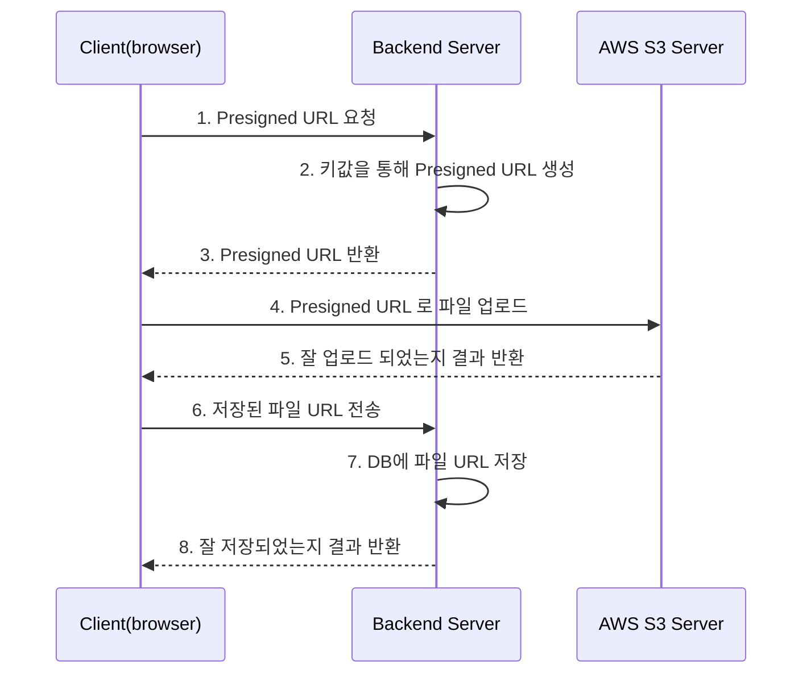
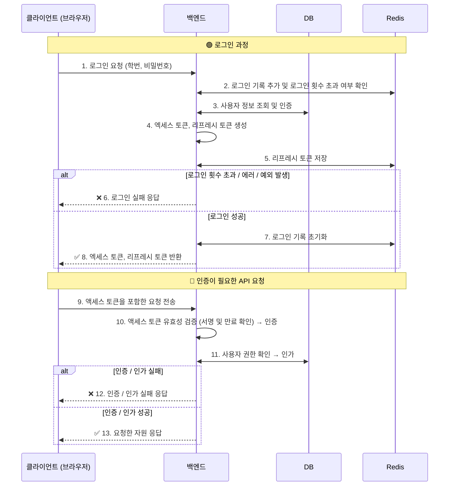

이번 글에서는 CEC 프로젝트에 아래 내용들을 적용한 이야기를 작성하겠다.
- [1. 픽스처 재사용](#1.%20%ED%94%BD%EC%8A%A4%EC%B2%98%20%EC%9E%AC%EC%82%AC%EC%9A%A9)
	- [1-1. 테스트 코드와 픽스처에 대해서](#1-1.%20%ED%85%8C%EC%8A%A4%ED%8A%B8%20%EC%BD%94%EB%93%9C%EC%99%80%20%ED%94%BD%EC%8A%A4%EC%B2%98%EC%97%90%20%EB%8C%80%ED%95%B4%EC%84%9C)
	-  [1-2. 픽스처 재사용 코드 작성하기](#1-2.%20%ED%94%BD%EC%8A%A4%EC%B2%98%20%EC%9E%AC%EC%82%AC%EC%9A%A9%20%EC%BD%94%EB%93%9C%20%EC%9E%91%EC%84%B1%ED%95%98%EA%B8%B0)
- [2. S3 파일 업로드 테스트](#2.%20S3%20%ED%8C%8C%EC%9D%BC%20%EC%97%85%EB%A1%9C%EB%93%9C%20%ED%85%8C%EC%8A%A4%ED%8A%B8)
	- [2-1. 현재 프로젝트의 파일 업로드 방식에 대해서 (Presigned URL)](#2-1.%20%ED%98%84%EC%9E%AC%20%ED%94%84%EB%A1%9C%EC%A0%9D%ED%8A%B8%EC%9D%98%20%ED%8C%8C%EC%9D%BC%20%EC%97%85%EB%A1%9C%EB%93%9C%20%EB%B0%A9%EC%8B%9D%EC%97%90%20%EB%8C%80%ED%95%B4%EC%84%9C%20%28Presigned%20URL%29)
	-  [2-2. S3ApiUtil 클래스 작성하기](#2-2.%20S3ApiUtil%20%ED%81%B4%EB%9E%98%EC%8A%A4%20%EC%9E%91%EC%84%B1%ED%95%98%EA%B8%B0)
	- [2-3. S3 파일 업로드 테스트 코드 작성하기](#2-3.%20S3%20%ED%8C%8C%EC%9D%BC%20%EC%97%85%EB%A1%9C%EB%93%9C%20%ED%85%8C%EC%8A%A4%ED%8A%B8%20%EC%BD%94%EB%93%9C%20%EC%9E%91%EC%84%B1%ED%95%98%EA%B8%B0)
- [3. 로그인 테스트](#3.%20%EB%A1%9C%EA%B7%B8%EC%9D%B8%20%ED%85%8C%EC%8A%A4%ED%8A%B8)
	- [3-1. 현재 프로젝트의 로그인 방식에 대해서 (JWT)](#3-1.%20%ED%98%84%EC%9E%AC%20%ED%94%84%EB%A1%9C%EC%A0%9D%ED%8A%B8%EC%9D%98%20%EB%A1%9C%EA%B7%B8%EC%9D%B8%20%EB%B0%A9%EC%8B%9D%EC%97%90%20%EB%8C%80%ED%95%B4%EC%84%9C%20%28JWT%29)
	- [3-2. 로그인 테스트 코드 작성하기](#3-2.%20%EB%A1%9C%EA%B7%B8%EC%9D%B8%20%ED%85%8C%EC%8A%A4%ED%8A%B8%20%EC%BD%94%EB%93%9C%20%EC%9E%91%EC%84%B1%ED%95%98%EA%B8%B0)

# 1. 픽스처 재사용
#### 1-1. 테스트 코드와 픽스처에 대해서
테스트 코드란 `어플리케이션의 특정 기능을 테스트 하는 코드`이다.
테스트가 실패하면, 코드에 수정이 필요함을 알려주고,
성공하면 코드가 의도대로 동작하고 있다는 신뢰를 준다.

예를들어, 덧셈 기능을 테스트 하는 코드는 다음과 같을 것이다.
```java
//given
int a = 1;
int b = 2;

//when
int result = add(a, b);

//then
assert result == 3;
```
위에서 given 절은 테스트에 필요한 값이나 상태를 준비하는 부분이고,
when 절은 테스트할 대상이 작동하는 부분,
then 절은 결과를 검증하는 부분이다.

이때 given 절에서 사용하는 테스트용 데이터나 설정 값을 [픽스처](https://en.wikipedia.org/wiki/Test_fixture#Software)라고 한다.
다음 단락에서는 이러한 픽스처를 재사용 가능한 형태로 만들어, 가독성과 유지보수성을 높이는 방법을 소개한다.

#### 1-2. 픽스처 재사용 코드 작성하기
CEC 프로젝트에 강의실 대여 기능이 있다.
이 기능의 테스트들에서 반복적으로 등장하는 given 절의 코드를.
아래와 같이 재사용 가능한 픽스처로 정의했다.
([링크](https://github.com/CEC-project/CEC-Back/blob/736fb032acf970a15c7f20841ab84984ffba4023/src/test/java/com/backend/server/fixture/ClassroomFixture.java))
```java
@AllArgsConstructor  
@Getter  
public enum ClassroomFixture {  
    강의실1(  
            "강의실1",  
            "설명1",  
            LocalTime.of(8, 0),  
            LocalTime.of(20, 0),  
            null,  
            1L,  
            Status.AVAILABLE),  
    강의실2(  
            "강의실2",  
            "설명2",  
            LocalTime.of(6, 0),  
            LocalTime.of(18, 0),  
            null,  
            1L,  
            Status.AVAILABLE);  
  
    private final String name;  
    private final String description;  
    private final LocalTime startTime;  
    private final LocalTime endTime;  
    private final String imageUrl;  
    private final Long managerId;  
    private final Status status;  
  
    public Classroom 엔티티_생성(User manager) {  
        return Classroom.builder()  
                .name(name)  
                .description(description)  
                .startTime(startTime)  
                .endTime(endTime)  
                .imageUrl(imageUrl)  
                .manager(manager)  
                .status(status)  
                .build();  
    }  
  
    public AdminClassroomRequest 등록_요청_생성(Long managerId) {  
        return AdminClassroomRequest.builder()  
                .name(name)  
                .description(description)  
                .startTime(startTime.format(DateTimeFormatter.ofPattern("HH:mm")))  
                .endTime(endTime.format(DateTimeFormatter.ofPattern("HH:mm")))  
                .imageUrl(imageUrl)  
                .managerId(managerId)  
                .build();  
    }  
  
    public void 엔티티와_비교(Classroom classroom) {  
        assertEquals(name, classroom.getName());  
        assertEquals(description, classroom.getDescription());  
        assertEquals(startTime, classroom.getStartTime());  
        assertEquals(endTime, classroom.getEndTime());  
        assertEquals(imageUrl, classroom.getImageUrl());  
        assertEquals(status, classroom.getStatus());  
    }  
}
```

코드를 살펴보면 아래와 같이 코드를 작성했다.
1. 자바의 enum 생성자 문법을 활용하여, 재사용할 픽스처 데이터를 넣었다.
2. db 에 저장할때 jpa의 엔티티 객체를 생성하여 저장해야 하니, 엔티티 객체를 만들어주는 메소드가 있다.
3. 강의실 등록 테스트 코드의 `given` 절에 등록 요청 객체를 만드는 코드가 중복될 것을 고려하여, 등록 요청 객체를 만드는 메소드를 작성하였다.
4. 강의실 등록/수정 등이 제대로 이뤄졌는지 확인하는 코드가 `then` 절에서 중복될 것을 고려하여, db 에 저장된 엔티티와 비교하는 메소드를 작성하였다.

결과적으로, 픽스처를 테스트 데이터와 관련된 중복된 코드를 줄일 수 있다는 것을 확인하였다.

# 2. S3 파일 업로드 테스트
#### 2-1. 현재 프로젝트의 파일 업로드 방식에 대해서 (Presigned URL)
아래 시퀸스 다이어그램은 CEC 프로젝트에서 파일이 업로드되는 과정을 간단히 표현한 것이다.


S3 에 실제 파일이 저장되고, DB에는 해당 파일의 URL만 저장된다.
예를들어, 첨부파일이 포함된 공지사항을 작성하는 경우의 흐름은 다음과 같다.
- `첨부파일`을 서버에 업로드하는 과정 : 1,2,3,4,5번 화살표
- `작성자 정보`, `공지사항 제목/내용`, `첨부파일 URL` 등 을 서버에 업로드하는 과정 : 6,7,8번 화살표

Presigned URL 방식은 아래와 같은 장점이 있다.
- 클라이언트가 S3에 직접 파일을 업로드하므로, 트래픽 비용을 절약할 수 있다.
- Presigned URL 의 만료 시간이나, 발급 정책을 조정하여 보안을 강화하기 용이하다.

아래와 같은 단점도 있다.
1. Presigned URL 생성을 위해 AWS SDK 를 사용해야 하므로, 코드 복잡도와 인지 부하가 늘어난다.
2. 파일 업로드와 DB 저장이 불일치 할 수 있다.
	- ex) 사용자가 파일을 S3에 업로드한 뒤, 게시글 등록을 취소하거나 오류가 발생하는 경우.
	- 파일 업로드용 API 가 따로 존재한다면 생길 수 있는 상황임.
	- 파일 저장 비용이 크지 않고, 업로드 기능이 악용되지 않는다면 이 문제는 크게 대비하지 않아도 된다.

현재 테스트 해야할 API 는 다이어그램 상에서 첫번째 API 이다.
아래 두가지 사항을 테스트하면 되는 것이다. (외부 저장소를 사용하는 테스트이므로 통합 테스트이다)
1. `1. Presigned URL 요청` 가 발생하면, `3. Presigned URL 반환` 까지 잘 이루어지는지 여부
2. `3. Presigned URL 반환` 에서 반환된 주소로 `4. Presigned URL 로 파일 업로드` 가 잘 되는지 여부

#### 2-2. S3ApiUtil 클래스 작성하기
파일 업로드를 테스트하기 위해선 아래 3가지 기능을 구현해야 한다.
1. 테스트용 파일을 업로드 하는 기능.
2. 테스트용 파일이 잘 업로드 되었는지 검증하는 기능.
3. 테스트용 파일을 삭제하는 기능.

아래는 위 3가지 기능을 구현한 [S3ApiUtil 클래스](https://github.com/CEC-project/CEC-Back/blob/736fb032acf970a15c7f20841ab84984ffba4023/src/test/java/com/backend/server/support/S3ApiUtil.java)의 코드이다.
1. @Component 어노테이션로 스프링 빈으로 등록하여, 어디서든 의존성 주입받아 쓸 수 있게 하였다.
2. RestTemplate, S3Client, S3Properties 세가지 클래스의 빈을 의존성 주입받아서 사용하고 있다.
	1. RestTemplate 은 스프링에서 제공하는 편리하게 REST API 요청을 하기위한 클래스이다. [RestTemplateConfig 클래스](https://github.com/CEC-project/CEC-Back/blob/736fb032acf970a15c7f20841ab84984ffba4023/src/test/java/com/backend/server/config/RestTemplateConfig.java) 에서 RestTemplate 클래스의 인스턴스에 로깅기능을 추가하고 빈으로 등록하였다. 검증을 위한 조회 요청을 하려고 의존성 주입받았다.
	2. S3Client 는 AWS SDK 에서 제공하는 클래스이다. 파일 삭제, 업로드를 하기 위해 사용한다.
	3. [S3Properties 클래스](https://github.com/CEC-project/CEC-Back/blob/736fb032acf970a15c7f20841ab84984ffba4023/src/main/java/com/backend/server/config/S3Config.java)는 이와 관련된 각종 설정값 등을 설정파일로부터 가져오는 클래스이다.

```java
@Component
public class S3ApiUtil {

    @Autowired RestTemplate restTemplate;
    @Autowired S3Client s3Client;
    @Autowired S3Properties s3Properties;

    public void upload(String presignedUrl, String content) {
        HttpHeaders headers = new HttpHeaders();
        headers.setContentLength(content.getBytes(StandardCharsets.UTF_8).length);

        ResponseEntity<String> response = restTemplate.exchange(
                URI.create(presignedUrl),
                HttpMethod.PUT,
                new HttpEntity<>(content, headers),
                String.class
        );

        assertThat(response.getStatusCode()).isEqualTo(HttpStatus.OK);
    }

    public ResponseEntity<String> get(String fileKey) {
        final String url = String.format("https://%s.s3.%s.amazonaws.com/%s",
                s3Properties.getBucket(), s3Properties.getRegion(), fileKey);

        try {
            return restTemplate.exchange(
                    url,
                    HttpMethod.GET,
                    new HttpEntity<>(new HttpHeaders()),
                    String.class
            );
        } catch (RuntimeException e) {
            return null;
        }
    }

    public void delete(String fileKey) {
        DeleteObjectRequest request = DeleteObjectRequest.builder()
                .bucket(s3Properties.getBucket())
                .key(fileKey)
                .build();
        s3Client.deleteObject(request);
    }
}
```

이제 위 S3ApiUtil 클래스를 이용한 테스트 코드를 작성하면 된다.
#### 2-3. S3 파일 업로드 테스트 코드 작성하기
아래 두가지 사항을 테스트하는 통합 테스트 코드를 작성하면 된다.
1. 클라이언트가 `Presigned URL 요청` 하면, 백엔드가 `Presigned URL 반환` 을 잘 하는지 여부
2. 반환된 URL 로 `Presigned URL 로 파일 업로드` 까지 잘 되는지 여부

아래 코드가 작성한 테스트 코드이다. ([링크](https://github.com/CEC-project/CEC-Back/blob/736fb032acf970a15c7f20841ab84984ffba4023/src/test/java/com/backend/server/api/common/s3/controller/CommonPresignedUrlControllerTest.java))
1. [@ControllerTest 어노테이션](https://github.com/CEC-project/CEC-Back/blob/736fb032acf970a15c7f20841ab84984ffba4023/src/test/java/com/backend/server/config/ControllerTest.java)은 테스트 클래스에 자주 붙이는 어노테이션을 모은 것이다.
2. MockMvc 을 이용하여 백엔드에 요청을 보내고 있다. [MockMvcConfig 클래스](https://github.com/CEC-project/CEC-Back/blob/736fb032acf970a15c7f20841ab84984ffba4023/src/test/java/com/backend/server/config/MockMvcConfig.java)에서 빈으로 등록했기 때문에 의존성 주입받아서 사용할 수 있었다.
3. 시나리오를 `Presigned URL 을 발급받는 시나리오`, `잘 업로드 되는지 검증하는 시나리오` 두가지로 나누어 각각 given, when, then 절을 두었다.
4. S3 를 사용하는 테스트이므로, 적지만 비용도 들 수 있고, 시간도 오래 걸릴수 있다. 따라서 [@EnabledIf 어노테이션](https://docs.spring.io/spring-framework/docs/current/javadoc-api/org/springframework/test/context/junit/jupiter/EnabledIf.html)을 사용하여 integration-test 라는 프로필이 설정된 경우에만 테스트가 실행되도록 하였다.
5. 현재 시간 텍스트가 저장된 짧은 텍스트 파일을 즉석에서 만들어 업로드를 테스트하였다.

```java
@ControllerTest
@DisplayName("CommonPresignedUrlController")
class CommonPresignedUrlControllerTest {

    @Autowired S3ApiUtil s3ApiUtil;
    @Autowired MockMvc mockMvc;

    @Nested
    class Presigned_URL_API_는 {

        @Test
        @EnabledIf(expression = "#{'${spring.profiles.active:default}' == 'integration-test'}", loadContext = true)
        void 파일_업로드가_가능한_URL을_응답한다() throws Exception {
            /* presigned url 을 발급받습니다. */
            //given
            final String fileContent = LocalDateTime.now().toString();
            final String fileName = String.format("%s.txt", fileContent);
            System.out.printf("file name : %s\tfile content : %s\n", fileName, fileContent);

            //when
            ResultActions result = mockMvc.perform(get("/api/s3/presigned-url")
                    .param("fileName", fileName));

            //then
            result.andExpect(status().isOk());

            String presignedUrl = toJsonPathDocument(result).read("$.data", String.class);
            /* presigned url 을 발급받습니다. */

            /* presigned url 로 파일이 잘 업로드 되는지 테스트 */
            //given
            s3ApiUtil.upload(presignedUrl, fileContent);

            try {
                //when
                ResponseEntity<String> response = s3ApiUtil.get(fileName);

                //then
                assertThat(response.getStatusCode()).isEqualTo(HttpStatus.OK);
                assertThat(response.getBody())
                        .as("업로드한 파일 내용과 업로드된 파일 내용이 일치하는지 확인합니다.")
                        .isEqualTo(fileContent);
            } finally {
                // 테스트로 업로드한 파일을 삭제하고, 잘 삭제되었는지 확인합니다.
                s3ApiUtil.delete(fileName);

                assertThat(s3ApiUtil.get(fileName))
                        .as("테스트용 파일이 삭제되었는지 확인합니다.")
                        .isNull();
            }
            /* presigned url 로 파일이 잘 업로드 되는지 테스트 */
        }
    }
}
```

# 3. 로그인 테스트
블로그 이전 글에서 `Rate Limit 기능` 과 `로그인 실패 횟수 제한 기능`을 구현하였다.
이 기능이 정상적으로 동작하는지, 그리고 로그인이 정상적으로 이루어지는지 테스트 코드를 작성하게 되었다.

#### 3-1. 현재 프로젝트의 로그인 방식에 대해서 (JWT)
현재 프로젝트는 인증 / 인가 에 JWT 방식을 사용한다.
현재 프로젝트의 `로그인 과정`, `인증이 필요한 API 요청` 로직을 각각 시퀸스 다이어그램으로 그리면 아래와 같다.



JWT 는 `인증 / 인가 / 정보 교환`을 목적으로 만들어진 기술(RFC 7519)이다. ([jwt.io 의 JWT 설명 참고](https://www.jwt.io/introduction#how-json-web-tokens-work))

일반적으로 JWT 로그인을 구현할때 두 종류의 JWT 토큰을 발급한다.
- 엑세스 토큰 : 만료시간이 짧으며, 로그인 이후 API 호출 시 인증에 사용된다.
- 리프레시 토큰 : 엑세스 토큰이 만료되면 재발급을 위해 사용되며, 주로 HttpOnly 쿠키에 저장한다.

`짧은 만료시간의 액세스 토큰` 및 `탈취를 대비한 리프레시 토큰의 블랙리스트 관리` 가 일반적인 전략이다.

JWT가 널리 사용되기 이전에는, 로그인 기능 구현에 **세션(Session)** 이 주로 사용되었다.
톰캣 웹 서버의 세션 기능을 사용하는 경우, 동작하는 방식은 다음과 같다.
1. 톰캣이 클라이언트 브라우저의 쿠키에 `JSESSIONID` 라는 키를 저장한다.
2. 톰캣이 `JSESSIONID`에 대응하는 `세션 객체`를 생성하고, 메모리(또는 외부 저장소)에 저장한다.
3. 생성된 `세션 객체`는 백엔드 애플리케이션에서 접근할 수 있다.
4. 백엔드 애플리케이션은 `세션 객체` 에 로그인 여부나 민감한 정보 등 사용자 상태를 저장할 수 있다.

JWT 는 세션 방식에 비하여, 아래와 같은 장점이 있다.
1. 민감하지 않은 정보를 토큰내에 담아서 API 호출 횟수 및 트래픽을 절감할 수 있다.
2. 벡엔드가 인증 토큰을 직접 다루므로, 인증 / 인가 전용 서버를 직접 구현 가능하다. 즉, 수평적 확장을 하기 쉬워지고, OAuth2 표준대로 소셜 로그인용 서버를 만들 수 있고, 도메인마다 서버를 나누기 쉬워진다.
3. `무상태 서버`(= 클라이언트의 정보를 가지지 않아서 확장이 쉬운 서버)에 더 가깝다.

물론 JWT 구현이 어렵고, 프로그래머의 역량에 따라 보안에 문제가 생길 확률이 높은 등등 단점도 많다.

#### 3-2. 로그인 테스트 코드 작성하기
테스트 할 시나리오는 아래와 같다.
1. 로그인 API 는 사용가능한 엑세스 토큰을 응답한다.
	- 로그인 요청 → 응답 받은 액세스 토큰으로 “내 정보 조회” API 호출
2. 로그인 API 는 일분간 연속 5회 실패시 Rate Limit 제한에 걸린다.
3. 로그인 API 는 로그인 성공시 실패 횟수가 초기화 된다.

로그인 API 를 테스트하는 코드는 아래와 같다. ([링크](https://github.com/CEC-project/CEC-Back/blob/736fb032acf970a15c7f20841ab84984ffba4023/src/test/java/com/backend/server/api/common/auth/controller/CommonAuthControllerTest.java))
1. pw 가 틀린 경우 / 맞은 경우의 중복 코드를 private 메소드로 분리시켰다.
2. @BeforeEach 에서 Redis 에 저장되는 키를 Mockito 라이브러리로 캡처하여, @AfterEach 에서 해당 키들을 삭제함으로써 테스트 간 격리를 유지했다.
3. Rate Limit 기능을 무시하고 테스트해야 하는 경우를 위해, FakeRateLimitConfig 클래스를 만들어서 다른 테스트 코드에서는 Rate Limit 를 무효화 시킬수 있도록 했다. ([링크](https://github.com/CEC-project/CEC-Back/blob/736fb032acf970a15c7f20841ab84984ffba4023/src/test/java/com/backend/server/config/FakeRateLimitConfig.java))
```java
class CommonAuthControllerTest {

    @Autowired private MockMvc mockMvc;
    @Autowired private PasswordEncoder passwordEncoder;
    @Autowired private UserRepository userRepository;

    @MockitoSpyBean private RateLimitRepository rateLimitRepository;

    final private List<String> capturedKeys = new ArrayList<>();

    @BeforeEach
    void setUp() {
        //로그인 테스트 진행할 계정 등록
        userRepository.save(MOCK_MVC_테스트시_로그인_계정.엔티티_생성(passwordEncoder, null));

        //redis 에 추가되는 rate limit 관련 key 를 캡처.
        doAnswer(invocation -> {
            String key = (String) invocation.getArguments()[0];
            capturedKeys.add(key);
            return invocation.callRealMethod();
        }).when(rateLimitRepository).add(any(), any());
    }

    @AfterEach
    void tearDown() {
        //다음 테스트에 영향이 없도록, 캡쳐한 rate limit 관련 key 들을 redis 에서 삭제.
        capturedKeys.forEach(rateLimitRepository::delete);
    }

    @Nested
    class 로그인_API_는 {

        @Test
        void 사용가능한_엑세스_토큰을_응답한다() throws Exception {
            /* 1. 로그인 */
            //given
			...
            //when
			...
            //then
			...
            /* 1. 로그인 */

            /* 2. 발급 받은 엑세스 토큰으로 내 정보 조회하기 */
            //given
			...
            //when
			...
            //then
			...
            /* 2. 발급 받은 엑세스 토큰으로 내 정보 조회하기 */
        }
        
        @Test
        void 일분간_연속_5회_실패시_Rate_Limit_에_걸린다() throws Exception {
            /* 1. 연속 5회 실패 */
            for (int i = 0; i < 5; i++)
                비밀번호가_틀린_로그인_요청을_보낸다().andExpect(status().isInternalServerError());
            
            /* 2. 6회 째에 올바르게 로그인 정보를 기입해도 429(Too many request) 에러 발생 */
            올바른_로그인_요청을_보낸다().andExpect(status().isTooManyRequests());
        }

        @Test
        void 로그인_성공시_실패_횟수가_초기화_된다() throws Exception {
            // 1. 4회 실패
            for (int i = 0; i < 4; i++)
                비밀번호가_틀린_로그인_요청을_보낸다().andExpect(status().isInternalServerError());

            // 2. 1회 성공
            올바른_로그인_요청을_보낸다().andExpect(status().isOk());

            // 3. 4회 싶패
            for (int i = 0; i < 4; i++)
                비밀번호가_틀린_로그인_요청을_보낸다().andExpect(status().isInternalServerError());

            // 4. 1회 성공
            올바른_로그인_요청을_보낸다().andExpect(status().isOk());
        }

        private ResultActions 올바른_로그인_요청을_보낸다() throws Exception {
            //given
            final CommonSignInRequest correctSignInRequest = MOCK_MVC_테스트시_로그인_계정.로그인_요청_생성();

            //when
            return mockMvc.perform(post("/api/auth/sign-in")
                    .contentType(MediaType.APPLICATION_JSON)
                    .content(convertToJson(correctSignInRequest)));
        }

        private ResultActions 비밀번호가_틀린_로그인_요청을_보낸다() throws Exception {
            //given
            final CommonSignInRequest wrongSignInRequest = MOCK_MVC_테스트시_로그인_계정.로그인_요청_생성();
            wrongSignInRequest.setPassword("wrongPassword");

            //when
            return mockMvc.perform(post("/api/auth/sign-in")
                    .contentType(MediaType.APPLICATION_JSON)
                    .content(convertToJson(wrongSignInRequest)));
        }
    }
}
```

여기까지 로그인 관련 테스트 코드를 모두 작성하였다.
지금 다시 본 프로젝트를 시작한다면, JWT 대신 세션 기반 인증 방식을 선택할 것 같다.
`리프레시 토큰 로테이션`, `CSRF 토큰`, `리프레시 토큰 블랙리스트 관리 전략` 등은 보안을 위해 반드시 고려해야 하는 주제이지만, 이를 직접 구현하려면 상당한 시간과 노력이 필요한 것 같다.

특히 이러한 보안 관련 기능들은 보통 프론트엔드 코드도 같이 작성해야 해서, 많은 노력이 필요하다고 생각한다.