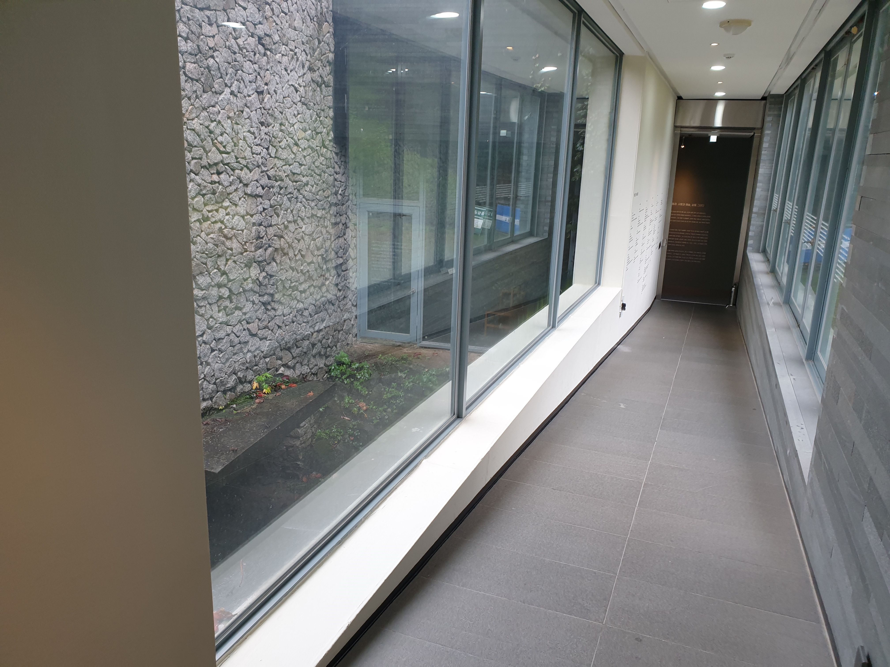
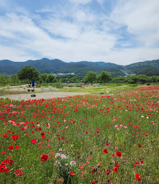
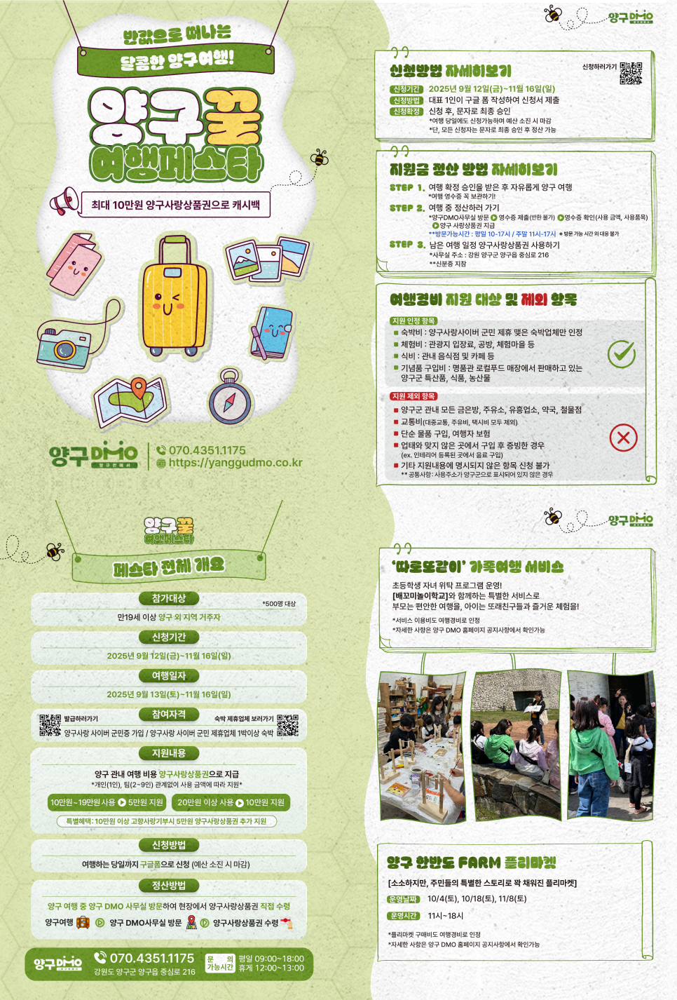

지금으로부터 약 1주일 전, 학창시절 친구 하나가 같이 놀러가자며 양구군에서 열리는 축제의 서포터즈를 신청 하자고 했다. 1박 2일 일정이었고, 첫날 서포터즈로서 축제를 돕고, 이튿날 관광을 하는 코스였다.

그 친구가 축제까지 쫓아다닐 정도로 외향?적이고 활동적인 친구였는지 잠시 의문을 품었지만, 서포터즈에게 주는 여행 지원 혜택에 대한 안내를 보고, 나도 오랜만에 힐링 여행을 즐기기 위해 신청하게 되었다. 나중에 알고보니 친구 역시 지인에게 영업당한 것이었다 ㅋㅋ

아무튼, 친구에게 영업당해 가긴 했지만 정말 재미있었고, 특히 같이 가신 서포터즈 분들의 활기찬 성격과 즐기는 모습에 나까지 점점 동화되어 더 재미있게 느껴졌다.

---

# 여행 기록
#### 공수리 마을 주막할매 축제
내가 서포터즈 활동을 하게된 축제이다. 파로호가 내려다 보이는 위치에서 진행되었으며, 먹을거리와 즐길거리가 상당했다. 그중 장난감 활/총으로 과녁을 맞추는 부스와, 윷놀이, 비석치기 부스를 우리 서포터즈들이 운영하였다.

가장 재미있었던 활동은 보트를 타고 파로호를 누비는 활동이었는데, 워터 슬라이드에서 느끼는 스릴 / 물을 가로지르는 재미를 느낄 수 있었다.
특히 파로호는 수많은 중공군을 물리치는등 6.25 전쟁 당시의 역사가 깊게 연관된 장소였는데, 집에 와서 아버지께 여쭤보니 아버지도 파로호를 알고 계셨다... 낚시를 좋아하셔서 아시는 건가?

아무튼 축제 기간동안 양구군을 들리게 된다면 한번쯤 가서 국밥도 먹고 경품 추첨도 즐겨보는건 어떨까?

아래는 내가 파로호에서 보트를 탄 영상이다. 원래 커브를 돌때가 진짜 스릴있는데 그건 찍지 못했다.

만약 가게 된다면 운전해주시는 분께 쎄게 달려달라고 해보자. 그럼 한참동안 신나게 커브를 돌 수 있을 것이다 ㅋㅋ 물론 물이 좀 튀는건 감안해야 한다.

---

#### 박수근 미술관
고등학생때 음악과 미술 과목중 미술 과목을 선택하여 들은 나인 만큼. 박수근님의 작품은 어렴풋이 기억하고 있었다. 투박한 그림체로 유명한 것을 알고 있었는데, 실제로 내가 보게될 줄은 몰랐다.

박수근 미술관은 몇개의 건물로 이루어져있었고, 각 건물마다 이동하는 시간이 있기 때문에 2시간 이상으로 넉넉하게 잡는다면 좋을것 같다. 5개의 건물중 어린이 미술관을 제외하면 4개이고, 이중 2개는 특별한 기획전시를 하는 곳으로 보인다.

작품을 봤을때 `캔버스가 아니라 돌에다 그린거 아닌가?` 하는 생각이 들 정도로 질감이 눈에 띄었는데, 나중에 검색해보니 박수근님은 캔버스에 물감을 바르고 굳히는 것을 반복하여 투박한 질감을 나타내었다고 한다.
아래는 작품 사진중 하나이다.

작품 뿐만 아니라, 건물도 눈에 띄었다.
건축에 문외한인 내 눈에도 건물 밖의 폭포나 돌담같은 조형물과 건물이 어우러지며, 건물과 건물을 이동할때 이리저리 코너를 돌며 끊임없이 시선을 환기시켜주는게 느껴졌다. 검색결과 2002년에 한국 건축가 협회에서 특선을 수여받은 건물이었다.

아래 사진은 `박수근 기념 전시관` 건물 내부의 통로 사진이다. 이 건물에 매표소가 있고, 바로 옆에 주차장이 있다.

아래 사진은 위 사진에 보이는 통로의 오른쪽 창이다. 아래 사진에서 물길과 건물로 들어온 입구를 볼 수 있고, 이 물길은 통로 아래를 지나서, 건물 바깥쪽으로 이어진다.

---

# 양구 여행지 추천

#### 파로호 꽃섬
이튿날 코스였지만 아쉽게도 비가 오는 바람에 들어가지 못한, 비운의 섬이다.
섬이라고는 하지만, 다리가 놓여져 충분히 건널 수 있게 되어있어서 다음에 양구를 간다면 이곳을 방문하는게 어떨까 한다.
아래는 구글에서 주워온 사진인데, 꽃이 참 많다.

#### 국토정중앙천문대
첫날의 마지막 코스였던 천문대이다.

설명해 주신 분이 누구셨는지에 대해서는 잘 기억이 안나지만, 참 설명도 맛깔나고 재미있게 잘 해주셨다.
국내에서 일반인이 볼수 있는 망원경중 세번째로 크다고 하셨다.
겨울에는 별이 아주 잘 보인다고 하며, 대신 추운것은 각오해야 한다고 하셨다 ㅋㅋ

- 별멍?
매월 하루씩 `별멍`(옥상에 누워서 별을 관찰) 프로그램을 운영한다고 하셨다.
겨울에 중무장하고 `별멍`한다면 상당히 좋은 추억이 될 듯 하다. 천문대 옆에 캠핑장도 있으니 캠핑장을 알아보고 이용하는 것도 괜찮을 것 같다.
[양구 천문대 공지사항](https://www.ygtour.kr/Home/H50000/H50100/H50101/boardList?cate_id=9&search_type=1&search_keyword=)
[양구 천문대 캠핑장](https://yanggu.ticketplay.zone/portal/index)
[양구 천문대 `별멍` 관련 기사](https://www.yna.co.kr/view/AKR20250309017700062)

---

# 후기
#### 감상
혼자서 노는걸 잘하고, 좋아하는 편인데, 정말 오랜만에 단체로 여행을 가니 정말 재미있었다.
가족과 놀러간 것을 제외하면, 고등학생 이후 처음으로 `1박 이상 단체 여행`을 한거 같은데, 아무래도 성인들끼리 여행을 간 것이기 때문에 훨씬 자유로울 수밖에 없었던 것 같다.
모르는 사람끼리 패키지 여행을 간다면 이런 비슷한 느낌이 날것 같다.

그런데 너무 자유로웠어도 각자 따로 노는 느낌이었을거 같은데, 첫날 축제 운영을 돕는 미션을 수행하며 내적 친밀감이 조금 생겼던 것 같고, 그때 이후로 좀 더 편해진것 같다.

이런 저런 활동을 했지만, 결국은 사람이 좋았기에 좋은 기억으로 남은것 같다. 서포터즈 운영진 분들이 티는 내지 않으셨지만 진행하면서 스트레스 많으셨을텐데 참 친절하셔서 좋았고, 참가자 분들은 성격도, 인상도 좋으셨다. 양구군 주민 분들도 흥이 많고 친절하셨다.

#### 할인 혜택에 대해
박수근 미술관과 국토정중앙천문대는 사이버 군민증이 있으면 양구군민에 준하는 할인 혜택을 받을수 있었다.
물론 사이버 군민증이나 신분증등을 보여 드려야 받을 수 있는 혜택이므로 잘 찾아보고 준비해가야 할것 같다.
- 박수근 미술관과 국토정중앙천문대는 나와 내 친구같은 파주시민(접경지역시장군수협의회주민)도 군민에 준하는 할인 혜택을 받을 수 있었다.
[사이버 군민증 제휴 관광지 목록](https://yanggudmo.co.kr/dmo_benefit)
[사이버 군민증 발급 사이트 (금방 한다)](https://yanggudmo.co.kr/dmo)

#### 양구여행꿀페스타에 대해
양구에서 최대 10만원까지 양구사랑상품권으로 환급해주는 이벤트가 있다고 한다.

1. 참여 자격
	1. 양구 외 지역 거주자
	2. 사이버 군민증 소지자
2. 지원 규모
	1. 10-19만원 사용시 -> 5만원 양구사랑상품권지급
	2. 20만원 사용시 -> 10만원 양구사랑상품권지급
3. 신청 방법
	1. 대표자 1인이 [구글폼](https://docs.google.com/forms/d/e/1FAIpQLSdzhExp63A9pbEFAGJseXbRCTOdb1B0Dwfnj68J4jI31mMY_g/viewform) 작성(만19세 이상만 가능)
		- https://docs.google.com/forms/d/e/1FAIpQLSdzhExp63A9pbEFAGJseXbRCTOdb1B0Dwfnj68J4jI31mMY_g/viewform
이왕 간다면, 혜택 받을 수 있는거 최대한 챙겨서 가면 좋겠다.